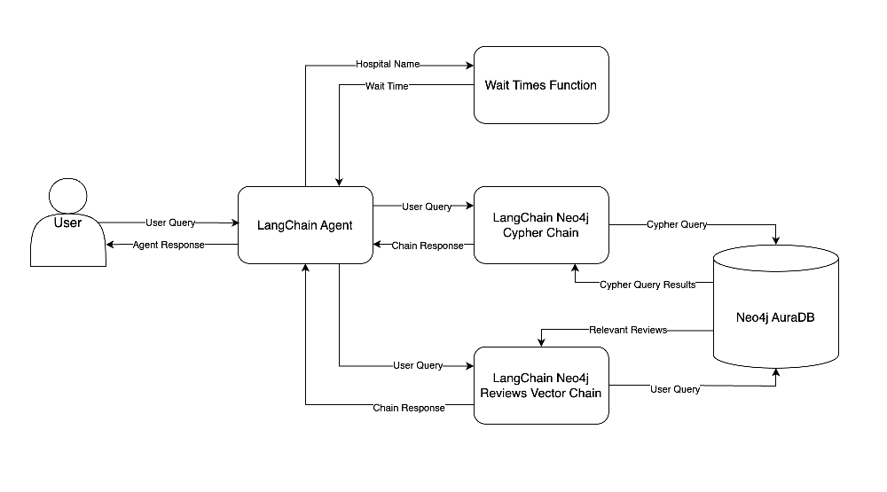
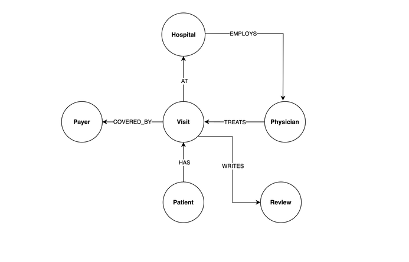

# Healthcare Chatbot

This fully functional RAG hospital chatbot interfaces with LangChain agent to answer healthcare related questions.

## Task Description 

Requirement is to have platform where is possible to find answers to ad-hoc questions about patients, visits, physicians, hospitals, waiting times in general or for some common surgical procedures and insurance payers without having to understand a query language like SQL, request a report from an analyst, or wait for someone to build a dashboard. Stakeholders want a single chat interface that can seamlessly answer both subjective and objective questions.
This means, when presented with a question, chatbot needs to know what type of question is being asked and which data source to pull from. For instance, if asked How much was billed for patient 789’s stay?, chatbot should know it needs to query a database to find the answer. If asked What have patients said about how doctors and nurses communicate with them?, chatbot should know it needs to read and summarize patient reviews.

## Used Data

Most of data is in CSV format and contains information about hospitals, physicians, patients, payers, visits and reviews. CSV files are hidden in my project repository, and are taken from [here](https://github.com/hfhoffman1144/langchain_neo4j_rag_app/tree/main/data). Besides this source, app is fetching average waiting time for some medical procedures in 17 OECD countries from [OECD Data Explorer](https://data-explorer.oecd.org/vis?df[ds]=dsDisseminateFinalDMZ&df[id]=DSD_HEALTH_PROC%40DF_WAITING&df[ag]=OECD.ELS.HD&df[vs]=1.0&pd=2010%2C&dq=..PT_PAT_WAIT_M_GT3.CM131_138...........WTSP...&ly[rw]=REF_AREA&ly[cl]=TIME_PERIOD&ly[rs]=WAITING_TIME&to[TIME_PERIOD]=false). It answers questions like : What is the average waiting time for artery bypass in Portugal? Country name is optional and if left out, gives average waiting time on the global level.

## Tools

* LangChain to build custom chatbot
* Set up of Neo4j Graph Database
* Used OECD API query builder to fetch waiting time for medical procedures 
* Serve the agent with FastAPI
* Chat UI with Streamlit
* Project orchestration with Docker Compose

## Chatbot Design

                    *taken from [Real Python](https://realpython.com/build-llm-rag-chatbot-with-langchain/)*

## Graph Database Design

Following diagram shows all nodes and relationships in the hospital system data:

                    *taken from [Real Python](https://realpython.com/build-llm-rag-chatbot-with-langchain/)*

## Conclusion

For me, there are quite some takeaways from this project: understanding how to integrate LangChain with my own data,  how retrieval augmented generation works, how to setup and move data to graph database, how to fine-tune chatbot with prompt-engineering techniques. Project was made on basis of this great [Real Python tutorial](https://realpython.com/build-llm-rag-chatbot-with-langchain/) and there you can find further project details.

WIP